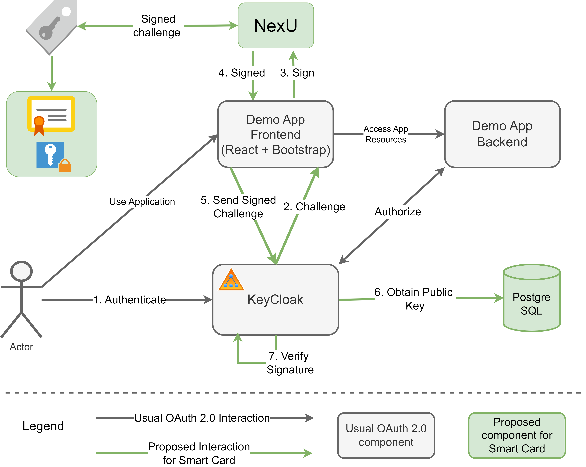
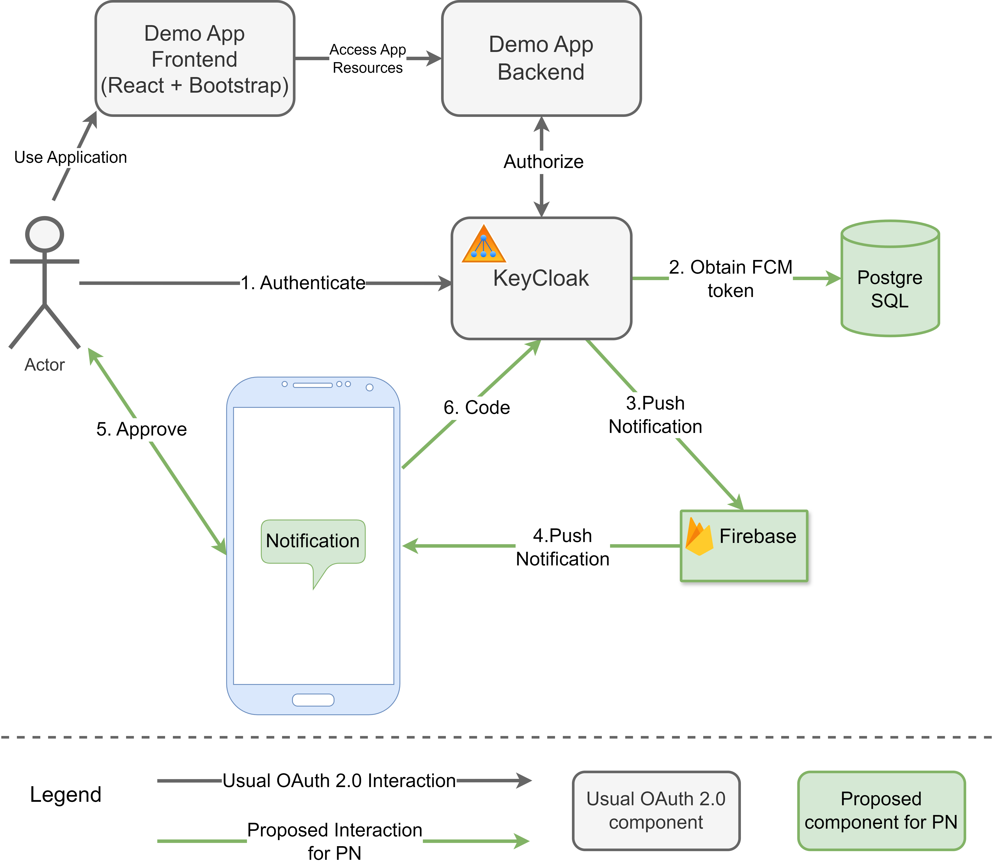
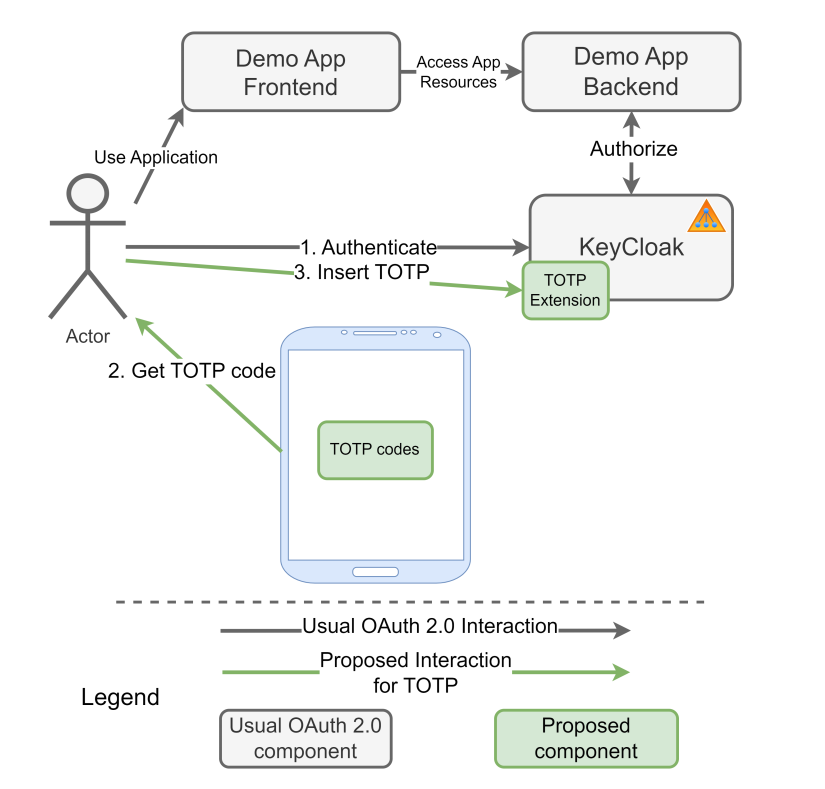

# Keycloak_2FA

## Overview

The proposed solution expands the range of two-factor authentication (2FA) methods integrated into Keycloak, introducing: Push Notification, Web Smart-card logon, and a customized implementation for TOTP.

## Installation

### TBD

## Web Smart-card logon

## Push Notification

## TOTP

